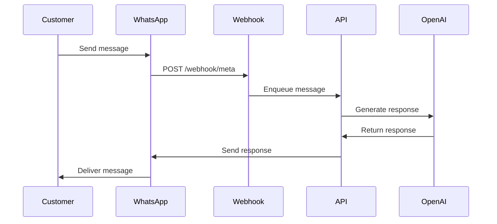

# WhatsApp Integration Guide

Complete guide to integrating WhatsApp Business API with the Multi-Channel AI Agent service.

## Prerequisites

- Meta Business Account
- WhatsApp Business Account (WABA)
- Verified business phone number
- System user with appropriate permissions

## Step 1: Set Up WhatsApp Business Account

### 1.1 Create Meta Business Account

1. Go to [Meta Business Suite](https://business.facebook.com/)
2. Click "Create Account"
3. Follow the setup wizard
4. Verify your business

### 1.2 Add WhatsApp Business Account

1. In Meta Business Suite, go to "WhatsApp Manager"
2. Click "Add WhatsApp Business Account"
3. Follow the setup process
4. Add and verify your phone number

### 1.3 Get Phone Number ID

1. In WhatsApp Manager, select your phone number
2. Click on "API Setup"
3. Copy the **Phone Number ID** (e.g., "836990829491415")
4. Save this as your `meta_phone_number_id`

## Step 2: Generate Access Token

### 2.1 Create System User

1. Go to Business Settings → Users → System Users
2. Click "Add" to create a new system user
3. Name it (e.g., "AI Agent System User")
4. Assign role: "Admin"

### 2.2 Generate Token

1. Select your system user
2. Click "Generate New Token"
3. Select your WhatsApp Business Account
4. Grant permissions:
   - `whatsapp_business_messaging`
   - `whatsapp_business_management`
5. Set token expiration (60 days or never)
6. Copy the access token (starts with "EAA...")
7. Save this as your `access_token`

## Step 3: Configure Webhook

### 3.1 Set Webhook URL

1. In WhatsApp Manager, go to "Configuration"
2. Click "Edit" next to Webhook
3. Enter your webhook URL: `https://your-domain.com/webhook/meta`
4. Enter a verify token (any random string)
5. Save the verify token as `WEBHOOK_VERIFY_TOKEN` in your environment

### 3.2 Subscribe to Webhook Fields

Subscribe to these webhook fields:

- `messages` - Incoming messages
- `message_status` - Delivery status updates

### 3.3 Verify Webhook

The system will send a GET request to verify your webhook:

```
GET https://your-domain.com/webhook/meta?hub.mode=subscribe&hub.verify_token=YOUR_TOKEN&hub.challenge=CHALLENGE_STRING
```

Your endpoint should respond with the challenge string.

## Step 4: Add Phone Number to API

### 4.1 Register User

First, create a user account:

```bash
curl -X POST https://api.example.com/v1/users \
  -H "Content-Type: application/json" \
  -d '{
    "email": "your@email.com",
    "name": "Your Name",
    "company_name": "Your Company"
  }'
```

Save the returned `user_id` and `api_key`.

### 4.2 Add WhatsApp Number

```bash
curl -X POST https://api.example.com/v1/users/YOUR_USER_ID/phone_numbers \
  -H "x-api-key: YOUR_API_KEY" \
  -H "Content-Type: application/json" \
  -d '{
    "platform": "whatsapp",
    "meta_phone_number_id": "836990829491415",
    "access_token": "EAAxxxx...",
    "display_name": "+1 (234) 567-8900"
  }'
```

Save the returned `phone_number_id`.

## Step 5: Create AI Agent

### 5.1 Create OpenAI Prompt

1. Log into [OpenAI Platform](https://platform.openai.com/)
2. Go to "Prompts" section
3. Click "Create Prompt"
4. Configure your agent behavior:

```
You are a helpful customer support agent for [Your Company].
Your role is to:
- Answer customer questions
- Provide product information
- Schedule appointments
- Collect lead information

Be friendly, professional, and concise in your responses.
```

5. Save the prompt and copy the `prompt_id`

### 5.2 Link Agent to Phone Number

```bash
curl -X POST https://api.example.com/v1/users/YOUR_USER_ID/agents \
  -H "x-api-key: YOUR_API_KEY" \
  -H "Content-Type: application/json" \
  -d '{
    "phone_number_id": "YOUR_PHONE_NUMBER_ID",
    "prompt_id": "YOUR_PROMPT_ID",
    "name": "WhatsApp Support Agent"
  }'
```

## Step 6: Add Credits

Add credits to your account for message processing:

```bash
curl -X POST https://api.example.com/v1/users/YOUR_USER_ID/credits \
  -H "x-api-key: YOUR_API_KEY" \
  -H "Content-Type: application/json" \
  -d '{
    "amount": 1000
  }'
```

## Step 7: Test Integration

### 7.1 Send Test Message

1. Open WhatsApp on your phone
2. Send a message to your business number
3. You should receive an AI-generated response

### 7.2 Verify Message Processing

Check message history:

```bash
curl -X GET "https://api.example.com/v1/users/YOUR_USER_ID/messages?limit=10" \
  -H "x-api-key: YOUR_API_KEY"
```

### 7.3 Monitor Webhook

Check your webhook logs to ensure messages are being received:

```bash
# Your webhook should receive POST requests like:
{
  "object": "whatsapp_business_account",
  "entry": [{
    "changes": [{
      "value": {
        "messages": [{
          "from": "1234567890",
          "text": { "body": "Hello" }
        }]
      }
    }]
  }]
}
```

## Message Flow



## Best Practices

### Message Formatting

- Keep messages under 4096 characters
- Use line breaks for readability
- Include clear call-to-action
- Avoid excessive emojis

### Response Time

- Respond within 24-hour window when possible
- Use template messages for re-engagement
- Set customer expectations for response times

### Conversation Management

- Maintain context across messages
- Handle conversation closures gracefully
- Archive old conversations appropriately

### Error Handling

- Monitor webhook failures
- Implement retry logic for failed messages
- Log all errors with correlation IDs
- Set up alerts for critical failures

## Troubleshooting

### Messages Not Being Received

1. **Check webhook configuration**
   - Verify webhook URL is correct
   - Ensure webhook is subscribed to `messages` field
   - Check webhook verification token

2. **Verify access token**
   - Ensure token has correct permissions
   - Check token expiration
   - Regenerate if necessary

3. **Check phone number status**
   - Verify phone number is active
   - Ensure phone number is verified
   - Check messaging limits

### Messages Not Being Sent

1. **Check credit balance**
   ```bash
   curl -X GET https://api.example.com/v1/users/YOUR_USER_ID/credits \
     -H "x-api-key: YOUR_API_KEY"
   ```

2. **Verify agent configuration**
   ```bash
   curl -X GET https://api.example.com/v1/users/YOUR_USER_ID/agents \
     -H "x-api-key: YOUR_API_KEY"
   ```

3. **Check message status**
   ```bash
   curl -X GET "https://api.example.com/v1/users/YOUR_USER_ID/messages?status=failed" \
     -H "x-api-key: YOUR_API_KEY"
   ```

### 24-Hour Window Expired

If more than 24 hours have passed since the customer's last message:

1. Use template messages for re-engagement
2. Create approved message templates in WhatsApp Manager
3. Send template message via API

### Rate Limiting

WhatsApp has rate limits:

- 1000 requests per second per phone number
- Messaging limits based on phone number tier

Monitor rate limit headers in API responses:

```
X-Business-Use-Case-Usage: {"call_count":10,"total_cputime":5,"total_time":3}
```

## Security Considerations

### Access Token Security

- Store tokens in environment variables
- Never commit tokens to version control
- Rotate tokens regularly
- Use system user tokens for production

### Webhook Security

- Verify webhook signatures
- Use HTTPS for webhook URL
- Implement rate limiting
- Log all webhook requests

### Data Privacy

- Comply with WhatsApp Business Policy
- Implement opt-out mechanisms
- Maintain audit logs
- Handle PII appropriately

## Monitoring & Analytics

### Key Metrics to Track

- Message volume (inbound/outbound)
- Response time
- Delivery success rate
- Credit consumption
- Error rates

### Monitoring Endpoints

```bash
# Get message statistics
curl -X GET "https://api.example.com/v1/users/YOUR_USER_ID/messages?limit=100" \
  -H "x-api-key: YOUR_API_KEY"

# Get extraction data
curl -X GET "https://api.example.com/v1/users/YOUR_USER_ID/extractions" \
  -H "x-api-key: YOUR_API_KEY"
```

## Next Steps

- [Instagram Integration Guide](instagram-setup.md)
- [Web Chat Integration Guide](webchat-setup.md)
- [Lead Extraction Configuration](lead-extraction.md)
- [API Reference](../api/openapi.yaml)

## Support

For additional help:

- API Documentation: https://docs.example.com
- Support Email: support@example.com
- Status Page: https://status.example.com
